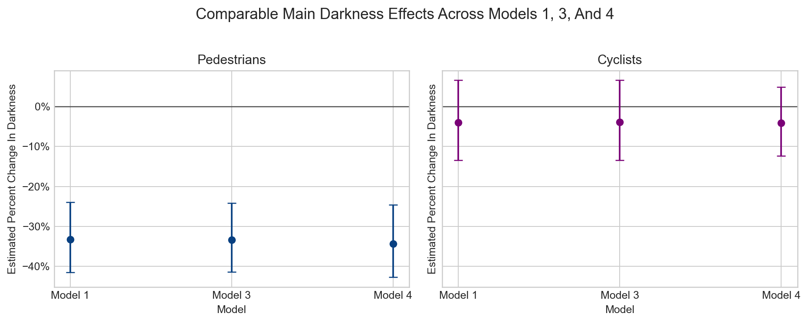
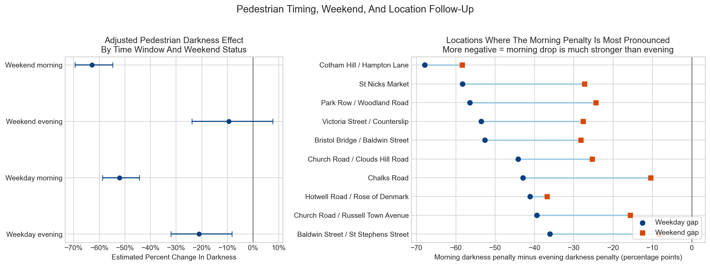
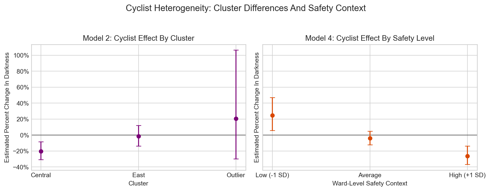
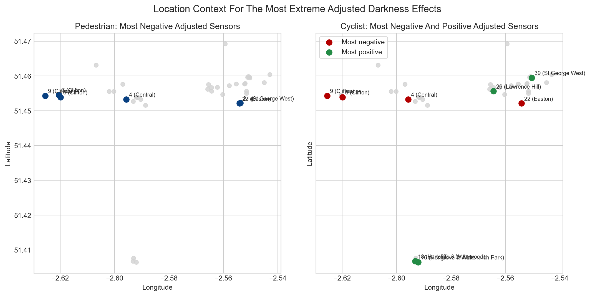

## Methods

### Data and analytical sample

The analysis used the cleaned Bristol hourly traffic-sensor panel developed in the project notebooks. After data cleaning, the final panel contained **37 sensors** and **325,008 hourly observations**. The Generalized Linear Model (GLM) analysis was restricted to the **mixed hours** used in the case-control design, namely `05:00`, `06:00`, `17:00`, `18:00`, `19:00`, and `20:00`, because these are the hours that switch between daylight and darkness over the year. This restriction makes the time-series analysis directly comparable to the matched odds-ratio approach while keeping the identification of darkness as clean as possible. Rows classified as `twilight` were excluded, so the main contrast was strictly **darkness versus daylight**.

The study question was whether darkness is associated with lower **pedestrian** and **cyclist** counts. These outcomes were modelled separately using the hourly `ped` and `cyc` counts. Darkness was represented by a binary `Dark` indicator derived from the solar classification already attached to each row. The analysis also included hourly weather controls (`temp_c`, `wind_ms`, `rain_mm`), calendar structure (`C(hour)`, `C(dow)`, `C(month)`), and short-run temporal dependence using lagged counts at one hour and twenty-four hours (`lag1`, `lag24`).

### Main modelling strategy

Because both outcomes are non-negative counts and the data are overdispersed, the main models were estimated as **Negative Binomial GLMs** with a log link. Standard errors were clustered by sensor. The baseline specification for each mode can be written as

$$
\log\{E(y_{it})\} =
\beta_0 + \beta_1 Dark_{it} + \beta_2 Lag1_{it} + \beta_3 Lag24_{it}
+ \gamma_h + \delta_d + \mu_m + \theta W_t + \alpha_i,
$$

where $y_{it}$ is either pedestrian count or cyclist count at sensor $i$ and hour $t$, $W_t$ is the weather vector, $\gamma_h$ are hour fixed effects, $\delta_d$ are day-of-week fixed effects, $\mu_m$ are month fixed effects, and $\alpha_i$ are sensor fixed effects. The sensor fixed effects absorb all time-invariant differences between sensors, including baseline location differences. Coefficients were converted to percentage changes using $100 \times (e^\beta - 1)$.

### Model ladder

Five related models were used.

| Model | Purpose | Additional terms beyond the baseline |
| --- | --- | --- |
| Model 1 | Main pooled darkness effect | `Dark` only |
| Model 2 | Spatial heterogeneity | `Dark × Cluster` |
| Model 3 | CCTV moderation | `Dark × cctv_z` |
| Model 4 | Safety moderation | `Dark × safety_z` |
| Model 5 | Built-environment moderation | `Dark × businesses_z` and `Dark × streetlights_z` |

In Models 2 to 5, the contextual variables were entered only through interactions with `Dark`. Their main effects were not separately estimated because they are time-invariant at sensor level and are therefore absorbed by the sensor fixed effects.

The final estimation sample for the main GLMs was **70,836 hourly rows** across the same **37 sensors** for both pedestrians and cyclists. The contextual variables were available for the full cleaned sensor set, so Models 3 to 5 used the same number of rows as the main model.

### Exploratory follow-up analyses

Three additional follow-up steps were used to support interpretation.

1. A **targeted pedestrian follow-up** examined hour-by-cluster pedestrian changes and ranked sensors by the size of their adjusted pedestrian darkness penalty.
2. A **pedestrian timing-and-weekend follow-up** fitted a single `Dark × Morning × Weekend` model, where `Morning = 1` for `05:00–06:00` and `Weekend = 1` for Saturday and Sunday, and then localised the strongest morning-sensitive sensors.
3. A **deeper cyclist follow-up** examined sensor-level cyclist darkness effects, raw cyclist changes by cluster and hour, and within-cluster safety/context models for `East` and `Outlier`.

These follow-up checks were used to explain the fitted patterns rather than to replace the main model ladder.

## Findings, interpretation and policy

### Findings at a glance

The evidence groups naturally into four policy-led bundles. Each bundle begins with the most defensible practical implication, then shows the data that justify it.

| Policy bundle | Why this follows from the data | Strongest supporting evidence | What it means in practice |
| --- | --- | --- | --- |
| 1. Audit and upgrade after-dark walking conditions across Bristol's main pedestrian network | Darkness is a large and robust deterrent to walking across Bristol, not a single-neighbourhood effect | Raw pedestrians: **116.9 daylight** vs **62.3 darkness**; **36 of 37** sensors fall in darkness; pooled GLM: **-33.3%**, `p = 1.48e-09` | Use the Bristol Transport Strategy and Safe Systems programme to improve crossings, interchange links, wayfinding, and the overall ease of walking after dark |
| 2. Make `05:00–06:00` a priority intervention and monitoring window on early-access corridors | The walking penalty is much stronger at `05:00–06:00` than in the evening, and the weekend test rules out a simple weekday-commuting-only explanation | Weekday evening **-21.0%** vs weekday morning **-52.1%**; weekend morning **-62.8%**; extra morning penalty `p = 2.18e-08`; weekend morning contrast `p = 1.37e-04` | Target the first package of lighting, crossing, and wayfinding upgrades on early-morning corridors such as Baldwin Street / Bristol Bridge / Victoria Street and Church Road, and monitor those same hours explicitly |
| 3. Diagnose and upgrade cyclist corridors route by route, starting with central and east Bristol | The pooled cyclist effect is weak because cyclist responses differ sharply by place and hour | Pooled cyclist GLM: **-4.0%**, `p = 0.446`; Model 2: **Central -20.5%**, **East -1.6%**, **Outlier +20.4%**; `Dark × East p = 0.045` | Use existing schemes such as Victoria Street improvements, Bristol Bridge / Baldwin Street changes, and east Bristol corridor work to test route-specific cyclist interventions rather than one citywide package |
| 4. Use context to choose where to intervene first and what package to install | CCTV adds almost nothing; safety matters for cyclists as a place-context signal; pedestrian timing is stronger than any single built-environment moderator | CCTV interactions: `p = 0.948` pedestrians, `p = 0.941` cyclists; cyclist `Dark × safety p = 0.000121`; weekend pedestrian context terms weak | Use LCWIP and East Bristol Liveable Neighbourhood corridors plus Bristol's LED street-lighting rollout to target pilot sites and intervention mixes, rather than relying on one explanatory variable |

### Bundle 1. Audit and upgrade after-dark walking conditions across Bristol's main pedestrian network

Figure 1 shows why Bristol should treat after-dark walking as a network-wide access problem and not just a hotspot problem. Once the raw daylight-versus-darkness difference is adjusted for hour, day of week, month, weather, lagged counts, and fixed sensor differences, the pedestrian darkness effect remains large and stable.

The raw data already suggested that walking and cycling should not be treated as one combined story. Mean pedestrian counts were **116.9 in daylight** and **62.3 in darkness**, while mean cyclist counts were **27.2 in daylight** and **17.6 in darkness**. At sensor level, **36 of 37** sensors showed lower pedestrian counts in darkness. That raw pattern also looked remarkably consistent across broad area types: pedestrians fell by approximately **-45.8% in Central**, **-47.1% in East**, and **-49.7% in Outlier**.

The adjusted models preserved that result. In **Model 1**, the pedestrian darkness effect was **-33.3%** with **p = 1.48e-09**. The result stayed close to one-third lower counts in **Model 3** (**-33.3%**, `p = 7.91e-10`), **Model 4** (**-34.3%**, `p = 2.01e-09`), and **Model 5** (**-33.8%**, `p = 1.33e-08`). Even the spatial heterogeneity model pointed in the same direction: **Central -32.6%**, **East -27.3%**, and **Outlier -48.3%**, with weak interaction p-values. So the main pedestrian result is not only statistically strong; it is also stable across specifications and broadly similar across the city.

This is the clearest overall answer to the report question. For walking, darkness looks like a general barrier during the mixed hours rather than a local problem confined to one part of Bristol. That fits directly with the [Bristol Transport Strategy](https://www.bristol.gov.uk/council/policies-plans-and-strategies/bristol-transport-strategy), which aims for an accessible and inclusive transport system, and Bristol's [A Safe Systems Approach to Road Safety: A 10 year plan, 2015 to 2024](https://www.bristol.gov.uk/residents/streets-travel/transport-plans-and-projects/road-safety-plans), which treats safe everyday walking as a citywide goal. The practical step is simple: use those programmes to check and improve the main walking network after dark, especially crossings, links to public transport, wayfinding, and the parts of the street environment that make ordinary walking trips feel easy or difficult. Bundle 1 therefore answers the broad question of **whether** darkness is a walking problem in Bristol.

### Bundle 2. Make `05:00–06:00` a priority intervention and monitoring window on early-access corridors

The next policy question is where Bristol should act first. The pedestrian timing follow-up shows that the broad walking problem identified in Bundle 1 is most acute at `05:00` and `06:00`, so Bristol should treat these as a formal priority window for intervention design and monitoring. The raw hour-by-cluster tables showed the largest pedestrian penalties at `05:00` and `06:00` in every cluster:

- **Central:** `-63.3%` at `05:00`, `-72.7%` at `06:00`
- **East:** `-36.6%` at `05:00`, `-55.0%` at `06:00`
- **Outlier:** `-57.4%` at `05:00`, `-76.4%` at `06:00`

That pattern was too strong to leave as a descriptive observation, so it was tested directly with a pedestrian model containing `Dark × Morning × Weekend`, where `Morning = 1` for `05:00–06:00` and `Weekend = 1` for Saturday and Sunday.

The adjusted timing model showed that the early-morning effect was real and materially larger than the evening effect. The estimated pedestrian darkness effect was **-21.0%** on **weekday evenings**, **-52.1%** on **weekday mornings**, **-9.4%** on **weekend evenings**, and **-62.8%** on **weekend mornings**. The extra morning penalty on weekdays was statistically strong (`p = 2.18e-08`), and the total morning darkness effect was **more negative on weekends than on weekdays** (`p = 1.37e-04` for the combined weekend morning contrast).

This matters because it changes the interpretation. Bundle 2 does not ask whether darkness matters; Bundle 1 has already shown that it does. Instead, it asks **when the citywide walking barrier is strongest** and what that timing pattern suggests about the trips being lost. A narrow weekday-commuting explanation would predict the morning darkness penalty to weaken on weekends. It did not. Weekend is only a proxy for lower commuter intensity, not proof of leisure travel, so the result does not identify one single mechanism. What it does do is rule out the simplest commuting-only story and point instead toward a broader early-day access problem that may include work trips, shift work, access to services, and routine movement before full daylight.

The location panel of Figure 2 helps make that more concrete. The strongest morning-sensitive sites clustered near **St Nicks Market**, **Bristol Bridge / Baldwin Street**, **Victoria Street / Counterslip**, **Park Row / Woodland Road**, and the **Church Road / Chalks Road** east Bristol corridor. These are access routes and mixed-use corridors, not obviously leisure-only settings. That makes the pattern look more like an early-morning access problem than a narrow leisure or commuter-only effect. The weekend-specific built-environment follow-up did not overturn this result. `Dark × Weekend × businesses_z` was weak (`p = 0.524`). `Dark × Weekend × streetlights_z` was only suggestive (`p = 0.081`), so it is not strong enough to claim that lighting is the cause. The more careful reading is that lighting may help, but probably as part of a wider package.

So the clearest reading of the timing bundle is that early-morning darkness is especially bad for walking, and that this is not confined to weekday commuting alone. The policy step is therefore specific. Bundle 1 says Bristol needs a citywide after-dark walking response; Bundle 2 says the **first package of works should go on early-morning access routes, interchanges, and corridor approaches**, especially around **Baldwin Street / Bristol Bridge / Victoria Street**, **Park Row / Woodland Road**, and the **Church Road / Chalks Road** corridor. The streetlight result should be used as support for **including lighting in that package**, not as a reason to rely on lighting alone. A practical package would combine better lighting, clearer crossings, simpler wayfinding, and a street layout that is easier to read in the dark, then test whether the `05:00–06:00` darkness penalty falls. This fits Bristol's current delivery context: the [East Bristol Liveable Neighbourhood](https://www.bristol.gov.uk/ask/projects/east-bristol-liveable-neighbourhood/about-the-east-bristol-liveable-neighbourhood) is already changing streets south of Church Road and north of the Avon, and its [monitoring framework](https://www.bristol.gov.uk/ask/projects/east-bristol-liveable-neighbourhood/monitoring-the-liveable-neighbourhood-trial) already tracks walking and cycling levels. The key monitoring question here is not simply “did walking increase?”, but “did the early-morning darkness penalty reduce on the routes the council changed?”

### Bundle 3. Diagnose and upgrade cyclist corridors route by route, starting with central and east Bristol

Cycling policy should not begin with one citywide after-dark response. The pooled cyclist GLM was only **-4.0%** with **p = 0.446**, so the citywide average effect was weak. But the raw cyclist data already suggested that this average could be hiding very different local patterns: cyclists fell by **-49.2% in Central**, **-24.4% in East**, and **+16.6% in Outlier**.

Figure 3 shows why the pooled cyclist result is not very informative on its own.

In **Model 2**, the cyclist darkness effect was **-20.5% in Central**, **-1.6% in East**, and **+20.4% in Outlier**, with a statistically meaningful `Dark × East` contrast (`p = 0.045`). The deeper cyclist follow-up showed that this was not just a reference-category artifact. At sensor level, adjusted cyclist effects were consistently negative in Central but highly dispersed in East and Outlier. The hour-by-cluster tables sharpened that pattern again: `Central` was negative in every mixed hour, especially at `05:00` (**-63.1%**) and `06:00` (**-72.1%**), while `East` was clearly negative at `06:00` but much flatter later in the day. `Outlier` was positive in most mixed hours and nearly flat at `06:00`.

This is the key cyclist finding. The weak pooled cyclist coefficient should not be read as “darkness does not matter for cycling.” It is better read as an average across routes that behave differently. In practical terms, the cyclist question is spatial: where does darkness reduce cycling, where does it not, and which corridors are involved? That is why the most relevant policy response is route-by-route diagnosis and upgrade rather than a blanket citywide cyclist programme. The clearest immediate candidates are corridors already on Bristol's programme: [Victoria Street improvements](https://www.bristol.gov.uk/residents/streets-travel/transport-plans-and-projects/victoria-street-improvements), which are creating a two-way separated cycle path linked to Bristol Bridge and Temple Gate and upgrading the Counterslip junction; the [changes to Bristol Bridge, Baldwin Street and Union Street](https://www.bristol.gov.uk/residents/streets-travel/transport-plans-and-projects/changes-bristol-bridge), which already prioritise buses and cycles through the city centre; and the east Bristol corridor work linked to the [East Bristol Liveable Neighbourhood](https://www.bristol.gov.uk/ask/projects/east-bristol-liveable-neighbourhood/about-the-east-bristol-liveable-neighbourhood), where Church Road and the Wesley Way parallel route are already policy priorities. The data suggest that central corridors such as the **Victoria Street to Bristol Bridge / Temple Gate** movement system and the **Old City / King Street / Queen Charlotte Street** corridor are more likely to show a real negative cyclist darkness effect than the city as a whole, while east Bristol needs a different route-by-route diagnosis because the cyclist pattern there changes by hour and by sensor.

### Bundle 4. Use place context to choose where to intervene first and what package to install

The final policy lesson is to use place context to decide where to intervene first and what should be installed there, not to search for one variable that explains everything. **CCTV did not add much**. In **Model 3**, `Dark × CCTV` was effectively null for both pedestrians (`p = 0.948`) and cyclists (`p = 0.941`). In plain terms, the data do not support a simple “more surveillance will solve the problem” explanation.

The cyclist safety result was stronger, but it has to be interpreted carefully. In **Model 4**, `Dark × safety` was weak for pedestrians (`p = 0.160`) but strong for cyclists (`p = 0.000121`). The deeper follow-up suggested that this pattern did not disappear within `East` and `Outlier`. In practice, that points to real route differences rather than one simple citywide cyclist story: more negative cyclist effects appeared around **Baldwin Street / Clare Street** and the **Portway / Bridge Valley Road / Hotwell Road** corridor, while more mixed or positive effects appeared around **Chalks Road / Church Road**, **Lawrence Hill**, and the **Oak House** area in south Bristol. Because the safety measure is fixed at ward level, the safest reading is not that safety itself causes the cycling pattern. It is that the safety variable helps identify parts of the network where the cyclist darkness effect behaves differently.

The most severe adjusted pedestrian effects were near **Baldwin Street / Clare Street** (**sensor `4`, -85.1%**), the **Hotwells Gyratory / Hotwell Road** side of Clifton ward (**sensor `8`, -83.6%**), and the **Barton Hill / Marsh Lane** side of Easton (**sensor `22`, -66.9%**). At cluster level, **Central** had the highest CCTV and business density, while **Outlier** had much lower business density and lower streetlight density, but those simple differences still did not translate into a clean single-variable explanation.

This final bundle matters because it prevents over-simplification. The data support strong prioritisation, but not the claim that one variable, such as CCTV, businesses, or streetlights, explains the results on its own. That is why context should be used in a practical way: to choose **which corridors should go first** and **what combination of measures they should receive**. The [West of England Local Cycling and Walking Infrastructure Plan 2020 to 2036](https://www.westofengland-ca.gov.uk/wp-content/uploads/2021/09/West-of-England-Local-Cycling-and-Walking-Infrastructure-Plan-2020-2036.pdf) identifies **Clifton Village and Whiteladies Road**, **Fishponds and Church Road**, **Knowle and Totterdown**, **Bedminster and Southville**, and **Hartcliffe and Hengrove Park** as priority areas. The clearest fit in the present data is east Bristol, where strong results in **Easton / St George West / Lawrence Hill** align well with the **Church Road / Chalks Road / Wesley Way** geography already being prioritised in the LCWIP and the East Bristol Liveable Neighbourhood. The city-centre signals around **Baldwin Street / Clare Street**, **Bristol Bridge**, and **Victoria Street** also fit Bristol's existing project geography well. By contrast, the Clifton/Hotwells evidence is more clearly about **Hotwell Road / Hotwells Gyratory / Portway / Bridge Valley Road** than about Whiteladies Road itself, so the policy match there should be handled more cautiously. The evidence therefore supports a clear sequence: start with east Bristol and city-centre corridors where the data and existing schemes already align, use Bristol's [Upgrading to LED street lighting](https://www.bristol.gov.uk/residents/streets-travel/transport-plans-and-projects/upgrading-to-led-street-lighting) programme as one part of the package, and combine it with corridor-specific crossing, layout, and wayfinding improvements rather than assuming that one measure will solve the problem on its own.

### Limitations

Several limitations should be acknowledged.

1. The analysis is observational, so coefficients should be interpreted as associations rather than definitive causal effects.
2. The GLMs were restricted to the mixed hours to preserve comparability with the case-control design and to identify darkness within hour. The findings therefore speak most directly to those commuter-transition periods, not to all hours of the day.
3. Contextual variables such as CCTV, safety, business density, and streetlight counts are time-invariant at sensor level. They are therefore useful as moderators, but they cannot capture short-term changes in local conditions.
4. The safety measure is a ward-level survey percentage rather than an hourly observed safety measure, which makes it especially important not to over-interpret the safety interaction causally.
5. The deeper sensor-level follow-up analyses are descriptive and exploratory. They are valuable for interpretation and prioritisation, but the strongest inferential conclusions remain those from the main pooled and clustered GLMs.
