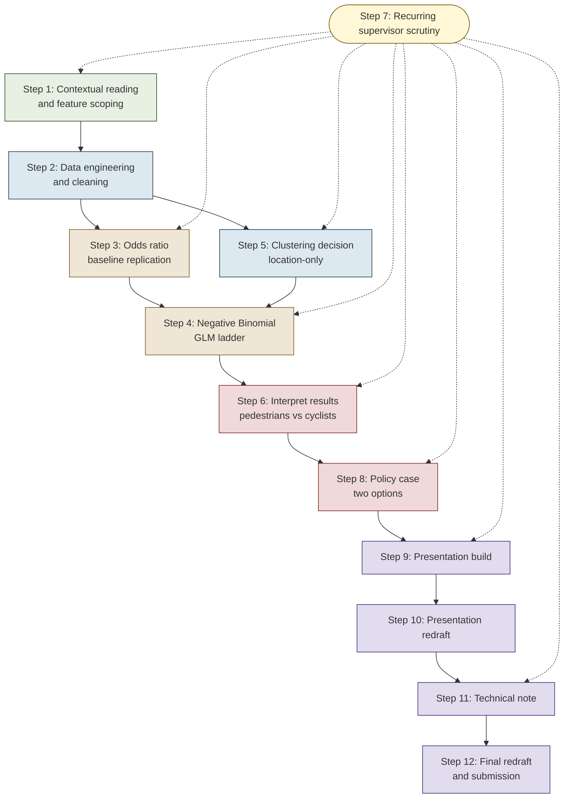

# Group 3 MDM Project Plan

A working plan for the darkness deterrence project. Three sections: the team management goals from the start, the rough flow we sketched out before any modelling, and the revised plan we are actually working through. Most of the live updates land in the revised plan.

---

## Initial goals (Team management goals)

- Meet at least once a week, ideally in person, with a quick action list written up afterwards.
- Set up a WhatsApp group chat for fast back and forth.
- Set up a shared Overleaf for the technical note so we are not emailing drafts around.
- Add everyone to the shared Git repo, with sensible branch and commit habits from day one.
- Keep a shared Kanban or task board so nobody is doubling up and nothing slips between people.
- Agree a tidy folder layout on Git early, with a clear README so anyone can find the cleaned data and the modelling notebooks.
- Treat the supervisor meetings as proper checkpoints, with a one-pager of progress before each one.

---

## Initial plan

A rough verbal flow chart of the project, written before any modelling started.

- Read the brief, agree what we are actually answering, and pin down what counts as light and dark.
- Pull in the Bristol footfall data and clean it up, plus the contextual stuff that might matter.
- Replicate the reference paper as a baseline, then build something more flexible on top of it.
- Read the results, split pedestrians and cyclists, and turn it into something a council could act on.
- Build the presentation as the main deliverable, with the technical note doing the heavy lifting in the background.
- Submit, then send the management report within a week.

---

## Revised plan

This is the live working version, kept loose on purpose so it can flex as findings come in. Steps are weighted by how much they actually matter to the final deliverables, so data engineering, the GLM ladder, the presentation and the technical note take the most space, and the supporting steps stay short.

### Step 1, contextual reading and feature scoping

A short evidence base on darkness, lighting, and active travel, plus one feature each (CCTV, businesses, streetlights, population, crime and safety, weather). Same routine for everyone: grab the data, clean it, plot it, overlay with footfall, push to Git, talk through it at the next meeting.

- Note Week 1 : agreed up front to replicate the breifing reference paper as the baseline before doing anything novel. Nicolai was firm on this and we stuck to it.
- Note 20 Feb : feature topics split one per person. Outputs all feed back into the same panel so things stay comparable.

### Step 2, data engineering and cleaning

This is the bit everything later sits on. Build an hourly panel of pedestrian, cyclist and car counts per sensor, slap a binary `Dark` flag on top from solar altitude, then merge in hourly weather (temp, wind, rain), CCTV count per sensor, business density, streetlight density, and ward-level safety. Drop any sensor with seven or more days of consecutive missing data, which leaves 37 sensors.

- Note 24 March : agreed on the 7-day missing data threshhold after testing alternatives internally. Need a small bar chart on the cleaning slide showing what removing the outlier sensors actually does.
- Note 18 Apr : pipeline lives in `new_branch/notebooks/` as `01` to `10`. Aim is to freeze it today so the modelling does not move underneath the slides.

### Step 3, baseline odds ratio replication

A straight replication of the reference paper's case-control matched odds ratio, restricted to the mixed clock hours (`05, 06, 17, 18, 19, 20`), pooled with Mantel-Haenszel. Three pooled summaries fall out: overall by mode, by cluster and mode, and by case-hour and mode.

- Note 30 March : cross-checking against the Nikolai reference paper, pending Nikolai confirming this is academiclly fine.
- Note 12 Apr: Add in Mantel-Haenszel to make results mroe interpreatable and ocmparable to OR os its clear and were doing liek for like!

### Step 4, Negative Binomial GLM 

This is where the GLM has to actually earn its place, doing analytical work the case control cannot. Create a Negative Binomial GLM with log link covering `Dark`, lags, hour, day-of-week, month, weather, and sensor fixed effects, with standard errors clustered by sensor. Include interactions of `Dark` with `Cluster`, `cctv_z`, `safety_z`, `businesses_z`, and `streetlights_z`, using model ladder 1-5. **Later decided: Sample stays restricted to the same mixed hours as the case control so the two methods stay directly comparable.** Coefficients reported as per cent changes via $100(e^\beta - 1)$. Evaluation pass covers Pearson dispersion at each rung, AIC across the ladder, and a Poisson vs Negative Binomial likelihood-ratio check on Model 1.

- Note 20 Mar: The model doesnt seem right Odds Ratios are WAY too high - Need to re-evaluate the whole process at some point.
- Note 26 Mar :  Use Model Ladder: Model 1 is a Negative Binomial GLM with log link covering `Dark`, lags, hour, day-of-week, month, weather, and sensor fixed effects, with standard errors clustered by sensor. Models 2 to 5 layer in interactions of `Dark` with `Cluster`, `cctv_z`, `safety_z`, `businesses_z`, and `streetlights_z`.
- Note 3 Apr : GLM restricted to the case-control hours, to make more comparable with the OR Method
- Note 3 Apr : pedestrian drop is around 33 per cent, cyclist drop only 4 to 5 per cent overall. Massive contrast. The cyclist story has to be split by cluster, otherwise the average just buries it.
- Note 22 Apr : Ensure we evaluate model in techn note: model evaluation paragraph done. AIC favours Model 4 for both outcomes, dispersion sits in the right place, Poisson rejected by orders of magnitude.

### Step 5, clustering decision

Activity-level clustering dropped because it uses the outcome variable. Settled on location-only: `Central`, `East`, `Outlier`. North and South dropped because the sample sizes are too small, with a justification slide in the deck.

- Note 12 March : going location-only. The Y-variable approach was circular so it had to go.

### Step 6, interpreting the results

Pedestrians and cyclists need separate framings. Pedestrians: minus 33 per cent pooled, broadly uniform across clusters, the strongest result we have. Cyclists: near-null pooled, with strong heterogeneity once Model 2 is fitted. The safety anomaly (lower-perceived-safety areas seeing an *increase* in cycling after dark) gets shown with limitations attached rather than buried.

- Note 3 Apr : safety anomaly is real but the qualitative sentiment data has individual benchmarking issues. Show it but flag the limits.
- Note 6 Apr : darkness has the biggest effect at 06:00 (leisure travel) and almost none during 17:00 to 19:00 (commuting). Pull this out as a finding on the time-of-day slide.

### Step 7, supervisor scrutiny

Sanity checks the binary light or dark definition, presses on whether the GLM is doing distinctive work, References need to be included everywhere, and more focus on the limtaitons of VivaCity Sensors - feels like were overselling the idea of our project a bit. Focus on The coherence in the project.

- Note 15 Apr: We need to include more about the limitations ie the Vivacity sensor's/camera limitations at the start.
### Step 8, policy case

Brief is consultancy-style, so the recommendations have to land as defensible options, not a single take it or leave it ask. Drafted policy first, then framed the GLM results around it, to avoid restating numbers in two places. Anchored to named Bristol and West of England policies (Bristol Transport Strategy, Safe Systems road safety plan, the West of England LCWIP, the East Bristol Liveable Neighbourhood, Victoria Street improvements, King Street pedestrianisation, the LED street-lighting upgrade programme).

- Note 6 Apr : adaptive LEDs sounded nice but we have no luminosity data, so the argument is weak. Streetlight density is more defendable.
- Note 6 Apr : target the 05:00 to 06:00 drop-off in low-light areas and push upgrades there, rather than blanketing the city. Two-option framing for the council.

### Step 9, presentation build

The 10-minute recorded presentation is the main deliverable. Structure is policy-led, with data and methods supporting the policy. Opens with motivation and the question, introduces the data and the sensors briefly with reproducibility deferred to the technical note, covers cleaning quickly with the bar chart of the outlier impact, defines an odds ratio in plain English, shows one comparison slide against the reference paper, transitions to the GLM as an extension that fixes the case control's weaknesses, splits pedestrians and cyclists, gives the council two policy options, and closes on limitations split into statistical and physical. Minimum text per slide, charts and maps doing the work, dynamic morph transitions where they help.

- Note 25 March : pitching as consultants, not students. Self-inspired investigation driven by the data.
- Note 1 Apr : aim for full slide draft on Git by **6 Apr**, full team walkthrough by **8 Apr**.

### Step 10, presentation redraft

After the first walkthrough, the redraft is about flow and signposting, not new analysis. Trim the opening slides, re-record the third spoken slide, merge limitations and results into one narrative, push implementation content to the back, tighten the data science section, add citation footers per slide, smooth presenter hand-offs, label every figure properly, and bin repeated results across slides.

- Note 6 Apr : first two slides cut, third re-recorded. References go on as small footers per slide rather than one list at the end. Implications section too long, needs trimming. Some slides have on-screen content nobody talks to, that goes.
- Note 12 Apr : aim to have the redraft locked by **15 Apr**
- Note 15 Apr: Still Over time, lots of redrafting to do for time, aswell as this Nikolai mentioned the cohesion wasnt great ie it was hard to follow slides weren't used well, from now on focus on this

### Step 11, technical note build

Up to five pages of LaTeX in self-contained sections, where the reproducibility detail lives. Sections: data engineering and the clean 37-sensor sample with the seven-day rule; the case-control method with the Mantel-Haenszel pooling formula and the validation against the reference paper; the Negative Binomial GLM with the full mean equation, the moderator z-scoring and the clustered standard errors; a short model-evaluation paragraph (AIC across the five rungs, dispersion at each rung, Poisson vs Negative Binomial likelihood ratio on Model 1); results mirroring the presentation but with full coefficient tables; limitations split into statistical and physical; a link to the public branch in `new_branch` of the Git repo with a short description of each subdirectory.

- Note 20 Apr : filename has to be `Group3-DarknessDeterrence-TechNote.pdf`. Anything we link from the report needs to be well commented, and the repo needs a clear README at the entry point.
- Note 20 Apr : aim for tech note v1 on Overleaf today!

### Step 12, final redraft and submission

A final pass once the technical note is done, since writing the note tends to flush out small inconsistencies in slide claims. Walk every slide and check each number is backed by the technical note, re-record any slide where the script has drifted, tidy any cluttered slides flagged in the second review, render the final video with the right filename, compile the technical note PDF, bundle the lot into `Group3-DarknessDeterrence-All.zip`.

- Note 20 Apr : Spend last day rigorously going through EVERYTHING before submission including full technical note walkthrough readthrough and editing for final coherence and time savings/
---

## Project flow chart

The dashed arrows off the supervisor scrutiny node mark the spots where we loop back for a methodological or policy check, rather than treating the input as one discrete step.